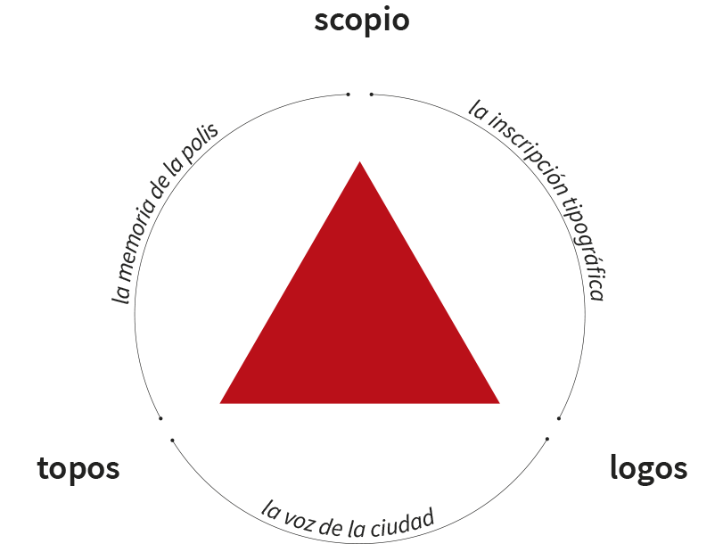

# Topo·logo·scopio

Este proyecto corresponde al trabajo presentado por la e[ad] Escuela de Arquitectura y Diseño PUCV a la muestra "Work in Progress" realizada en la Facultad de Arquitectura y Estudios Urbanos PUC en abril de 2015.

## Equipo e[ad]
- [Juan Carlos Jeldes](http://wiki.ead.pucv.cl/index.php/Juan_Carlos_Jeldes)
- [Valentina Roco](http://wiki.ead.pucv.cl/index.php/Valentina_Roco)
- [Rodrigo Saavedra](http://wiki.ead.pucv.cl/index.php/Rodrigo_Saavedra)
- [Herbert Spencer](http://hspencer.info)

### Aplicación Web
Esta aplicación —que forma parte de la muestra— se ocupa del reconocimiento de voz del público asistente para ser proyectada de forma tipográfica en el muro contiguo.

El HTML (index.html) debe ser visualizado en __Google Chrome__ y debe, además, contar con conexión a Internet ya que hace uso la API de Webkit. 

##### Dependencias
- [Jquery](https://jquery.com/)
- [P5.js](http://p5js.org/)

### Agradecimientos
- [José Poblete](https://twitter.com/pollinx)
- [Hugo Solar](https://twitter.com/hugosolar)

# Planteamiento Artístico

#### Topo·logo·scopio: diálogo urbano para Valparaíso

El espacio público de Valparaíso es un espacio en disputa, como el de tantas otras ciudades. Esta disputa se fija, en mayor o menor medida, en la forma arquitectónica, urbana y paisajística resultante que en su conjunto constituye la ciudad. Pero el espacio urbano es también, por definición, abierto y público: todos tenemos palabra y postura frente a este espacio  en un divergencia creativa, expresión de las diversas voluntades y anhelos. Pero esta conversación es invisible y privada, alcanzando sólo la visibilidad producto de la controversia y la disputa.

Planteamos que el desafío urbano actual es recomponer el estatus simbólico del espacio público como “espacio para la representación”; constituyendo diversos hitos escenográficos para dar cabida esta conversación pública (agones), prefigurando la justa y necesaria convergencia que culmina en la forma construida de la ciudad, forma en constante transformación y ajuste. El arquetipo es el ágora griega o el foro romano, hoy ausentes en forma y función. Pero más gravemente, en espíritu. 

La palabra inscrita en el espacio público tiene una tradición de autoridad oficial, en opsición al grafitti; forma subrecticia y rebelde. La palabra espacial-espaciada viene a decir de aquello que debe permanecer para guardarse en la memoria colectiva. Apela al sentido de lo trascendente de la polis. 

Aquí, la palabra intencionada puede quedar fija, (o fijada, al menos por un tiempo, en su cuota de permanencia borrada por el clamor de las otras voces, en una suerte de palimpsesto razonado). 

## Propuesta

Proponemos un espacio para aquellos lugares donde la ciudad se muestra para ser contemplada. Pensamos que estos son los lugares para referirse a ella; los metalugares donde la ciudad se autocontempla. En este pormenor de ciudad, el mobiliario es hospitalario al acto de la conversación ciudadana, porque permite y recibe a la palabra intencionada. Esto es lo que habilita la técnica de hoy: pasar del sonido de las palabras al espacio de la tipografía por medio del reconocimiento de voz.  Esto permite pasar de la fragilidad del momento íntimo de dicha conversación a la elocuencia inequívoca del espacio tipográfico de voz  “formalizada”.

Pero dicha formalización está sujeta a los equívocos propios de la fragilidad de la información: la voz transformada en sonido es enviada a un servicio de Google, quien opera como nueva autoridad que define lo relevante y trascendente, ofreciendo servicios aparentemente gratuitos a costo de someternos a su escrutinio. Estos sonidos son analizados y devueltos como texto, traducidos sólo en la medida de lo algorítmicamente posible.  El algoritmo es hoy también un commodity posible para el equipamiento de la ciudad.

Los croquis muestran el espacio publico en Valparaiso. Miradas diversas que se desprenden de la posición de los cuerpos, el ojo y el cuerpo se separan. El aproximarse al borde y contemplar una lejania, situación propia de un espacio que conjuga distancias sobre las cuales se puede dialogar.

Topo·logo·scopio es un espacio leve que vincula lugar y palabra, revelando en sus límites y en su  posibilidad de detención, una cualidad propia de los espacios públicos espontáneos de los cerros de Valparaíso, que es el hacer aparecer el aquí y el allá, una conjunción de proximidad y lejanía, ante y dentro de la cual se puede dialogar.La lejanía irrumpe arrojando la palabra de un aquí a un allá.

### Agradecimientos especiales
- A los estudiantes de arquitectura '''Sebastian Ginsberg e Ignacio Favilla.